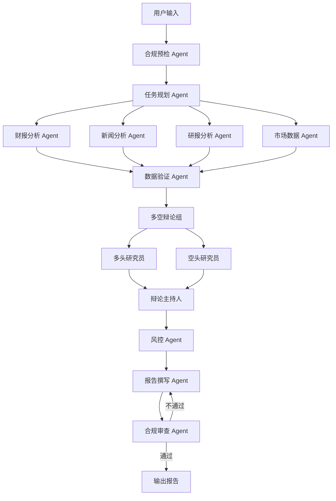

# 架构文档

## 项目简介

输入股票代码或行业名称，自动收集财报、新闻、研报、市场数据，经过多空辩论和风险评估，输出一份带引用来源和风险提示的投资研究报告。所有结论必须可追溯，所有操作必须合规。

## 架构图

## Agent 角色清单

| 编号 | 名称 | 职责 | 技术点 |
|------|------|------|--------|
| 1 | 合规预检 | 输入检查、限流、审计 | 安全边界、成本控制 |
| 2 | 任务规划 | 根据公司类型动态拆解任务 | 动态规划 |
| 3 | 财报分析 | 解析 PDF，提取财务指标 | RAG、工具编排 |
| 4 | 新闻分析 | 搜索新闻，情感分析 | 工具编排、RAG |
| 5 | 研报分析 | 检索研报，提取观点 | RAG、语义检索 |
| 6 | 市场数据 | 股价、估值、成交量 | 工具编排 |
| 7 | 数据验证 | 交叉验证不同来源 | 失败恢复、评估 |
| 8 | 多空辩论 | 多头 vs 空头辩论 | 多 Agent 辩论式 |
| 9 | 风控合规 | 风险识别、合规审查 | 安全边界、评估 |

## 工具清单

| 工具名 | 功能 | 危险级别 |
|--------|------|----------|
| parse_pdf | 解析财报 PDF | 只读 |
| extract_financial_metrics | 提取财务指标 | 只读 |
| search_news | 搜索新闻 | 只读 |
| analyze_sentiment | 情感分析 | 只读 |
| search_reports | 检索研报 | 只读 |
| get_stock_price | 查股价 | 只读 |
| get_valuation | 查估值 | 只读 |
| calculate_ratio | 算财务比率 | 只读 |
| cross_validate | 交叉验证 | 只读 |
| generate_chart | 生成图表 | 写入 |
| save_report | 保存报告 | 写入 |
| send_notification | 发送通知 | 危险 |
| query_database | 查数据库 | 只读 |
| execute_code | 沙箱执行代码 | 危险 |

## 数据流说明

所有 Agent 共享一个 FinanceState 状态对象。每个 Agent 从状态中读取自己需要的字段，处理完后把结果写回状态。LangGraph 负责调度：合规预检通过后进入任务规划，任务规划输出子任务列表，触发 4 个数据收集 Agent 并行执行，全部完成后进入数据验证，验证通过后进入多空辩论，辩论结束后依次经过风控、报告撰写、合规审查，最终输出报告。任何一步失败，状态会被持久化到 SQLite，支持断点续跑。
